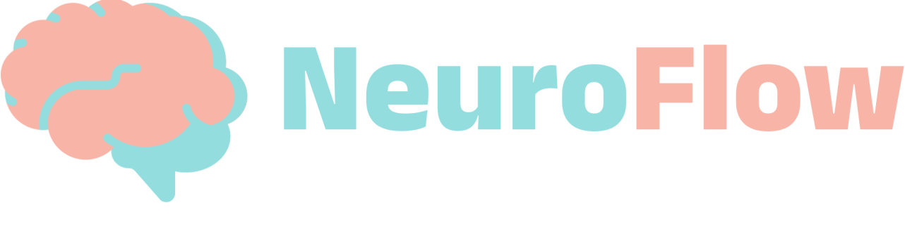
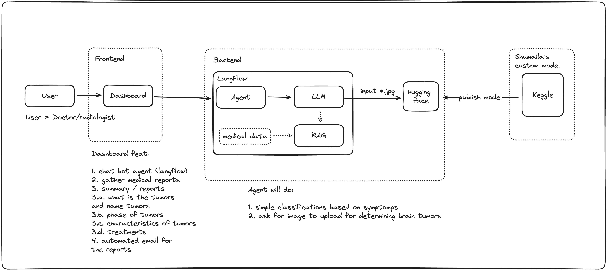
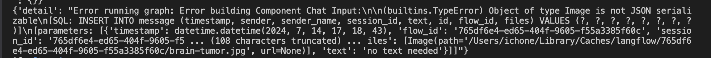

<h1 align="center">
    
</h1>

# 🧠 Neuro Flow
Neuro Flow - Enabling Brain Tumor Detection Through AI

## Main Features
### 🩻 Brain Tumor - Image classification 
By uploading images to our models, we could help expedite brain tumor diagnosis by analysis brain MRI images and outputing whether there is indications of tumors and what type of tumors.

### 🧑‍⚕️ Brain Tumor Specialist Assistant 
Our models also build in to assist doctors/neurologist and even user (as preliminary diagnosis) to help answers any question related to brain tumors - for example related to symptoms and treatment.

## 🔨 Project Architecture and Tech Stack
This repository contains 3 main components
1. Landing Page (Frontend)
2. LangFlow - exported json and datasets
3. streamlit - UI for chat agents

## 📚 System Architecture

## 🚀 Tech Stacks
### Frontend
- React (Landing Page)
- Streamlit (Chat agents)

### Backend
- LangFlow (https://github.com/ichwanhs96/langflow)

## 📝 Challenge / Feedback
- LangFlow - HuggingFace models component doesn't support image classification. We are challenged to build our own components which written inside `/LangFlow` folder and https://github.com/ichwanhs96/langflow 
- LangFlow - LangFlow generated API for Image Upload (through ChatInput component) is buggy due to JSON serialize issues during SQL insertion as attached in the picture below. Given enough time we should be able to help figure out on how to fix this bug

## 🧑‍💻 How to develop
To contribute and run this project, go to each folder and follow the README

[Frontend](/Frontend/README.md)
[LangFlow](/LangFlow/README.md)
[streamlit](/streamlit/README.md)